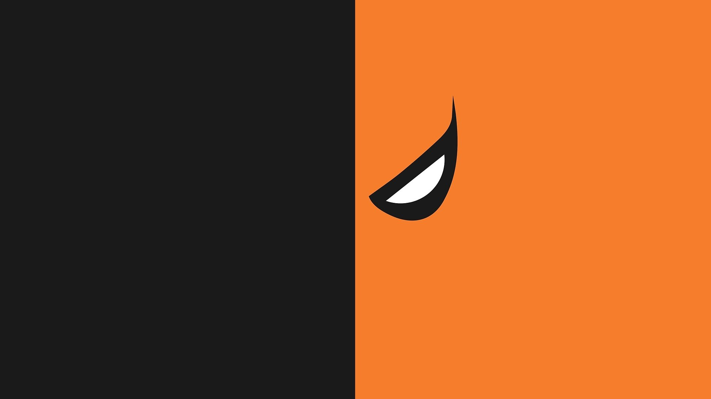

# Wireframe del proyecto

## Contenido
- NAV - menú
 - Secciones: Concepto del proyecto con imágenes, Historia ficción, fichas de objetos, vídeo del stand.   
body
- Heroscreen
 - nombre proyecto
 section I
- Concepto
 - 3 imágenes
 
 section II
- Historia de ficción
 -  con una imágen (hombre del muñeco)
 
 Sectio III
- 4 Fichas de artefactos
 - imágen delstand, generalidades y foto original
 
 section IV
 - Vídeo del stand
 
footer 
Redes, copy, logotipo ICONOS

# Fundamentos1_materia
## markdown
### Evaluación - csss, Html - Hero-screen
Secciones agregadas (Herosreen e información)

Imagen recuperada

- lista
- lista 2

<!--### tre-->

<!--#### hgfdfd-->

[death Wallpaper](https://www.pinterest.es/pin/566468459353882899/)

;

